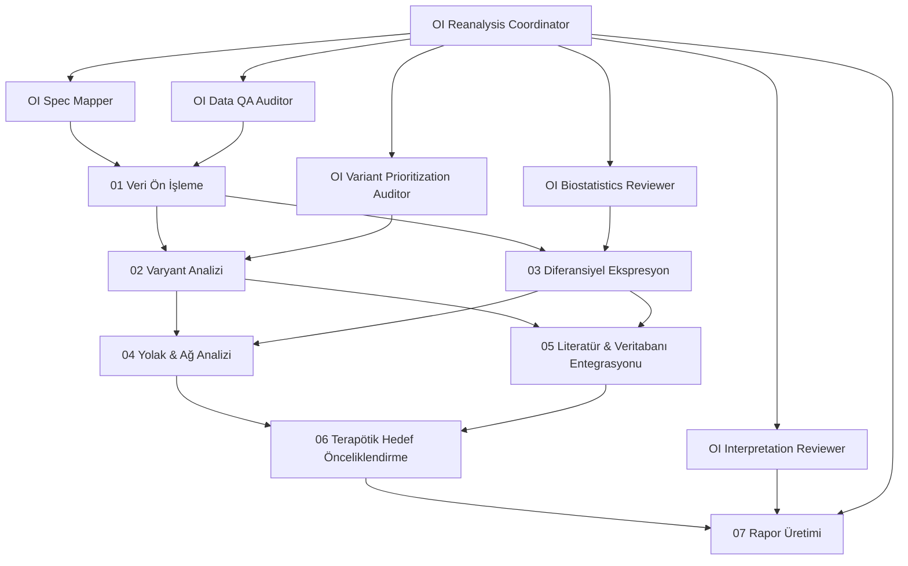

# Bölüm 1 — miRNA Prompt Analizi

Aşağıdaki analiz, `miRNA_agent_prompts` altındaki tüm dosyaların incelenmesiyle hazırlanmıştır.

## 1) `miRNA_agent_prompts/AGENTS.md`
1. **Promptun Amacı:** Notebook reanalysis sürecinin sabit kurallarını tanımlamak (fixed groups/tasks, notebook-only hesaplama, leakage-safe yaklaşım).
2. **Kullanım Senaryosu:** Koordinatör veya alt ajanlar çalıştırılmadan önce global çalışma kontratı olarak.
3. **Girdiler:** `miRNA-qPCR-reanalysis.md`, `miRNA-qPCR-analysis-results.csv`, mevcut notebook içeriği.
4. **Beklenen Çıktılar:** Doğrudan çıktı üretmez; süreç için zorunlu uyum koşulları tanımlar.
5. **Teknik Yapı:** Kural-temelli yönerge dokümanı; hard constraints + ambiguity fallback.
6. **Güçlü Yönler / Eksiklikler:**
   - Güçlü: Sabit görev/grup korunumu net.
   - Eksik: Girdi/çıktı şeması formal değil, doğrudan run manifest standardı yok.

## 2) `.github/prompts/mirna-reanalysis-orchestrated.prompt.md`
1. **Amaç:** Koordinatör ajan üzerinden uçtan uca orkestrasyon.
2. **Senaryo:** Komple notebook inşa/review görevleri.
3. **Girdiler:** Governing spec + data + user objective.
4. **Çıktılar:** Risk listesi, edit aksiyonları, confidence labels, blockers.
5. **Teknik Yapı:** Frontmatter + orchestrated step list + quality gates.
6. **Güçlü/Eksik:**
   - Güçlü: Delegasyon sırası iyi tanımlı.
   - Eksik: Domain biyolojisi (miRNA dışı klinik bağlam) genişletmeye hazır ama parametrik şema sınırlı.

## 3) `.github/agents/mirna-reanalysis-coordinator.agent.md`
1. **Amaç:** Uzman alt ajan çıktısını sentezlemek.
2. **Senaryo:** Bölüm bazlı notebook ilerletme.
3. **Girdiler:** Spec, notebook, alt ajan bulguları.
4. **Çıktılar:** Section status + evidence hooks + risk flags + next actions.
5. **Teknik Yapı:** Coordinator contract + delegation policy + quality gates.
6. **Güçlü/Eksik:**
   - Güçlü: Minimum output contract güçlü.
   - Eksik: Toolchain entegrasyonu (harici biyoinformatik araç) explicit değil.

## 4) `.github/agents/spec-mapper.agent.md`
1. **Amaç:** Direktifleri notebook uygulanabilir checklist’e dönüştürmek.
2. **Senaryo:** Planlama başlangıcı.
3. **Girdiler:** Spec + AGENTS + mevcut notebook.
4. **Çıktılar:** Directive_ID bazlı yapılandırılmış checklist.
5. **Teknik Yapı:** Deterministic mapping şablonu.
6. **Güçlü/Eksik:**
   - Güçlü: Blocker evidence zorunlu.
   - Eksik: Öncelik skorlama/risk ağırlığı yok.

## 5) `.github/agents/data-qa-auditor.agent.md`
1. **Amaç:** Şema/missingness/transformation risk denetimi.
2. **Senaryo:** Modeling öncesi veri hazırlık doğrulaması.
3. **Girdiler:** CSV şema ve dönüşüm adımları.
4. **Çıktılar:** Issue tablosu + impact seviyeleri + notebook aksiyonları.
5. **Teknik Yapı:** Risk rank + log destination.
6. **Güçlü/Eksik:**
   - Güçlü: Inferential risk vurgusu doğru.
   - Eksik: Çoklu veri kaynağı birleşiminde anahtar eşleme kuralları sınırlı.

## 6) `.github/agents/biostatistics-reviewer.agent.md`
1. **Amaç:** Test seçimi, varsayım, multiplicity, effect-size denetimi.
2. **Senaryo:** İstatistik blokları finalize edilmeden önce.
3. **Girdiler:** Test çıktıları, varsayım kontrolleri.
4. **Çıktılar:** accept/revise/reject + düzeltme önerileri.
5. **Teknik Yapı:** Conservative reviewer şablonu.
6. **Güçlü/Eksik:**
   - Güçlü: Overclaim düşürme kuralı güçlü.
   - Eksik: Klinik endpoint heterojenliği için özel şablon yok.

## 7) `.github/agents/modeling-leakage-auditor.agent.md`
1. **Amaç:** Sınıflandırmada leakage ve validation bias denetimi.
2. **Senaryo:** Pairwise classification öncesi/sonrası audit.
3. **Girdiler:** Pipeline adımları, feature selection, thresholding akışı.
4. **Çıktılar:** Leakage risk sınıfı + fix plan + residual risk.
5. **Teknik Yapı:** Task bazlı risk matrisi.
6. **Güçlü/Eksik:**
   - Güçlü: Fold-contained preprocessing zorunluluğu.
   - Eksik: Varyant+ifade hibrit modeller için genişletme gerektirir.

## 8) `.github/agents/interpretation-reviewer.agent.md`
1. **Amaç:** İddiaları robust/tentative/exploratory/unsupported etiketlemek.
2. **Senaryo:** Son rapor yorumu öncesi.
3. **Girdiler:** Analiz bulguları + narrative metin.
4. **Çıktılar:** Claims table + caveat language.
5. **Teknik Yapı:** Skeptical review template.
6. **Güçlü/Eksik:**
   - Güçlü: Doğrudan overclaim engelleme.
   - Eksik: Tedavi/ilaç hedef iddiaları için ek kriter gerek.

## 9) `.github/agents/README.md`
1. **Amaç:** Sistem mimarisi ve kullanım talimatı.
2. **Senaryo:** Onboarding + smoke test.
3. **Girdiler:** Agent dosyaları.
4. **Çıktılar:** Dokümantasyon.
5. **Teknik Yapı:** Agent inventory + operational notes.
6. **Güçlü/Eksik:**
   - Güçlü: Kullanım akışı net.
   - Eksik: Versioning/change-log standardı ayrı değil.

---

# Bölüm 2 — Karşılaştırmalı Değerlendirme (miRNA vs OI)

## Benzer ihtiyaçlar
- Multi-step orchestration (spec→QA→stats→interpretation)
- Conservative claims + caveat zorunluluğu
- Reproducibility ve audit trail gereksinimi
- Belirsizlikte explicit logging

## Farklı ihtiyaçlar
- OI tarafında varyant patojenite ve genotip-fenotip ekseni daha merkezi.
- OI’de COL1A1/COL1A2 biyolojik çekirdek bilgi zorunlu.
- miRNA’da leakage odaklı pairwise sınıflandırma baskın; OI’de varyant+ekspresyon+klinik entegrasyon daha geniş.
- OI için dış veritabanı/araç uyumluluğu (GATK, DESeq2, VEP, STRING, OMIM API) açık gereksinim.

## Dönüşüm prensibi
miRNA prompt mimarisi korunarak OI’ye şu eklemeler yapılmıştır:
- Kategori bazlı 7 prompt
- Her promptta formal girdi/çıktı şeması
- Varyant/terapötik hedef için özel audit kuralları
- Klinik entegrasyon parametreleri

---

# Bölüm 3 — OI Agent Prompt Seti

OI için oluşturulan tam dosya seti (geçici klasörde):

- `oi_agent_prompts_draft/AGENTS.md`
- `oi_agent_prompts_draft/.github/agents/README.md`
- `oi_agent_prompts_draft/.github/agents/oi-reanalysis-coordinator.agent.md`
- `oi_agent_prompts_draft/.github/agents/oi-spec-mapper.agent.md`
- `oi_agent_prompts_draft/.github/agents/oi-data-qa-auditor.agent.md`
- `oi_agent_prompts_draft/.github/agents/oi-biostatistics-reviewer.agent.md`
- `oi_agent_prompts_draft/.github/agents/oi-variant-prioritization-auditor.agent.md`
- `oi_agent_prompts_draft/.github/agents/oi-interpretation-reviewer.agent.md`
- `oi_agent_prompts_draft/.github/prompts/reanalysis-orchestrated.prompt.md`
- `oi_agent_prompts_draft/.github/prompts/data-preprocessing.prompt.md`
- `oi_agent_prompts_draft/.github/prompts/variant-analysis.prompt.md`
- `oi_agent_prompts_draft/.github/prompts/differential-expression.prompt.md`
- `oi_agent_prompts_draft/.github/prompts/pathway-network-analysis.prompt.md`
- `oi_agent_prompts_draft/.github/prompts/literature-database-integration.prompt.md`
- `oi_agent_prompts_draft/.github/prompts/therapeutic-target-prioritization.prompt.md`
- `oi_agent_prompts_draft/.github/prompts/report-generation.prompt.md`

Tam metinler için ek dosya:
- `oi_agent_prompts_draft/OI_prompt_set_full_text.md`

Kullanım kılavuzu (özet):
1. `reanalysis-orchestrated` ile başla.
2. Kategori promptlarını sırayla çalıştır (01→07).
3. İhtiyaç halinde uzman ajan review pass uygula.
4. Final raporda confidence ve caveat etiketlerini zorunlu tut.

---

# Bölüm 4 — Pipeline Entegrasyon Haritası (Mermaid)

---

## Not
- Bu çıktı seti kullanıcı talebine göre **geçici klasörde** korunmuştur.
- Prompt ve agent dosyaları ayrıca proje içine entegre edilmiştir: `.github/prompts/` ve `.github/agents/`.
